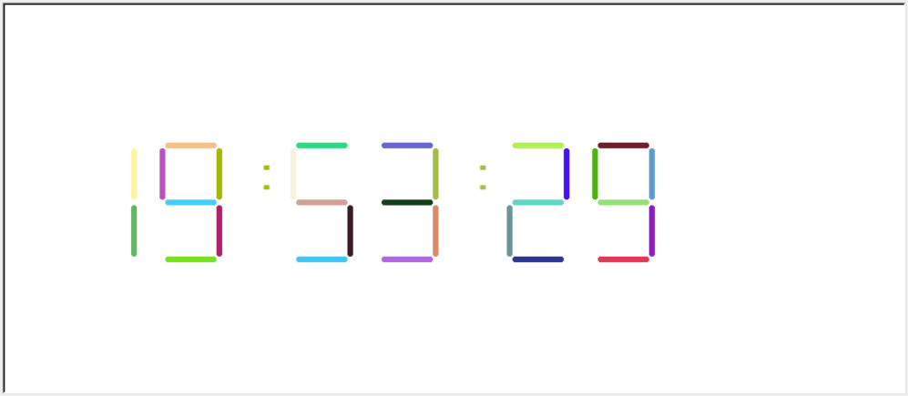

# README
## WELCOME
感谢你使用我制作的简易桌面时钟
## WHAT IS THIS
DIGIT ALARM是一个基于Python开发的桌面闹钟，你可以在启动时输入一个时间，程序会不断在桌面以数码管的形式绘制你电脑当前的时间，直到你输入的时间停止，并播放一段音乐作为提示。
## WHAT IS SPECIAL
### COLORFUL
DIGIT ALARM采用了随机数算法生成笔画的RGB值，每一笔都是一次对未知的探索！
### SIMPLE BUT USEFUL
DIGIT ALARM所拥有的功能很简单，但它在需要计时的时候很好用，例如Design Thinking、Brain Storm等过程，如果你像我一样，希望在计时的时候屏幕不要闲置，DIGIT ALARM将是一个不错的选择。
## HOW TO USE IT
·启动DIGIT ALARM

·输入你所希望的闹铃时间（时，分）

·按下回车，开始愉快地计时

·使用时你将获得这样的一个界面

## FOR MORE
如果你希望完善DIGIT ALARM，或者使用过程中出现了任何问题，随时欢迎你将你的想法和意见反馈给我。
·E-mail：402927348@qq.com